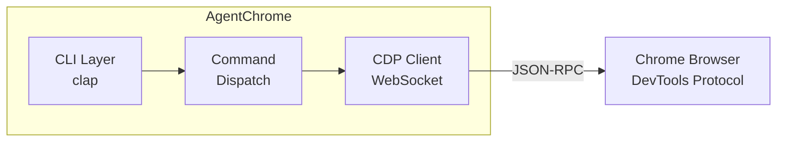

# AgentChrome

**Give your AI agent browser superpowers.**


<!--  TODO: uncomment when published -->

AgentChrome is a native CLI tool that lets AI coding agents — especially [Claude Code](https://docs.anthropic.com/en/docs/claude-code) — control Chrome through the DevTools Protocol. Every command outputs structured JSON, uses accessibility-tree UIDs for element targeting, and returns typed exit codes for programmatic error handling. No Node.js, no Python, no MCP server — just a fast Rust binary your agent calls from the shell.

## Give Claude Code Browser Powers in 2 Minutes

**1. Install AgentChrome** (see [Installation](#installation) for more options)

```sh
cargo install agentchrome
```

**2. Drop the CLAUDE.md template into your project**

```sh
curl -fsSL https://raw.githubusercontent.com/Nunley-Media-Group/AgentChrome/main/examples/CLAUDE.md.example > CLAUDE.md
```

**3. Ask Claude Code to use the browser**

> "Check if the login form at localhost:3000 works correctly"

Behind the scenes, Claude Code will run commands like:

```sh
agentchrome connect --launch --headless
agentchrome navigate http://localhost:3000/login --wait-until networkidle
agentchrome page snapshot
agentchrome form fill-many '[{"uid": "s2", "value": "test@example.com"}, {"uid": "s3", "value": "password123"}]'
agentchrome interact click s4 --include-snapshot
agentchrome console read --errors-only
```

See the full [Claude Code Integration Guide](docs/claude-code.md) for workflows, efficiency tips, and error handling patterns.

## Why AgentChrome?

### Built for AI Agents

- **JSON output by default** — every command returns structured, parseable output
- **Accessibility tree snapshots with UIDs** — `page snapshot` assigns stable UIDs (e.g., `s1`, `s5`) to interactive elements for reliable targeting
- **Structured exit codes** — 0 (success), 1 (general error), 2 (connection error), 3 (target error), 4 (timeout), 5 (protocol error) for programmatic error handling
- **Self-documenting CLI** — `agentchrome capabilities` outputs a machine-readable JSON manifest of every command, flag, and argument
- **`--include-snapshot` on interactions** — get the updated accessibility tree in the same response as a click or form fill, cutting round-trips in half

<details>
<summary><strong>Full Browser Control</strong></summary>

- **Tab management** — list, create, close, and activate browser tabs
- **URL navigation** — navigate to URLs, go back/forward, reload with wait strategies
- **Page inspection** — accessibility trees, text extraction, element search
- **Screenshots** — full-page, viewport, element, or region captures
- **JavaScript execution** — run scripts in page context, return results as JSON
- **User interactions** — click, hover, drag, type, press keys, scroll
- **Form filling** — fill inputs, select options, upload files, batch fill with `fill-many`
- **Network monitoring** — list, inspect, and follow requests in real time
- **Console capture** — read and follow console messages with type filtering
- **Device emulation** — mobile devices, network/CPU throttling, geolocation, color scheme
- **Performance tracing** — record traces, analyze insights, measure Core Web Vitals
- **Dialog handling** — accept, dismiss, or respond to alert/confirm/prompt dialogs

</details>

## How It Works



AgentChrome communicates with Chrome using the [Chrome DevTools Protocol](https://chromedevtools.github.io/devtools-protocol/) (CDP) over WebSocket. Run `agentchrome connect --launch --headless` to start a session — subsequent commands reuse the connection automatically. Native Rust binary, <50ms startup, <10MB on disk.

## Comparison

How AgentChrome stacks up for giving AI agents browser access:

| | AgentChrome | Puppeteer / Playwright | Chrome DevTools MCP |
|---|---|---|---|
| **AI agent integration** | CLI — works with any agent that runs shell commands | Requires JavaScript wrapper | MCP protocol (specific client required) |
| **Runtime** | No Node.js — native Rust binary | Node.js | Node.js |
| **Install** | Single binary, `cargo install` | `npm install` | `npx` |
| **Interface** | CLI / shell scripts | JavaScript API | MCP protocol |
| **Startup time** | < 50ms | ~500ms+ | Varies |
| **Binary size** | < 10 MB | ~100 MB+ (with deps) | Varies |
| **Shell pipelines** | First-class (`| jq`, `| grep`) | Requires wrapper scripts | Not designed for CLI |

## Installation

### Cargo install

```sh
cargo install agentchrome
```

### Pre-built binaries

Download the latest release for your platform from [GitHub Releases](https://github.com/Nunley-Media-Group/AgentChrome/releases).

<details>
<summary>Quick install via curl (macOS / Linux)</summary>

```sh
# macOS (Apple Silicon)
curl -fsSL https://github.com/Nunley-Media-Group/AgentChrome/releases/latest/download/agentchrome-aarch64-apple-darwin.tar.gz \
  | tar xz && mv agentchrome-*/agentchrome /usr/local/bin/

# macOS (Intel)
curl -fsSL https://github.com/Nunley-Media-Group/AgentChrome/releases/latest/download/agentchrome-x86_64-apple-darwin.tar.gz \
  | tar xz && mv agentchrome-*/agentchrome /usr/local/bin/

# Linux (x86_64)
curl -fsSL https://github.com/Nunley-Media-Group/AgentChrome/releases/latest/download/agentchrome-x86_64-unknown-linux-gnu.tar.gz \
  | tar xz && mv agentchrome-*/agentchrome /usr/local/bin/

# Linux (ARM64)
curl -fsSL https://github.com/Nunley-Media-Group/AgentChrome/releases/latest/download/agentchrome-aarch64-unknown-linux-gnu.tar.gz \
  | tar xz && mv agentchrome-*/agentchrome /usr/local/bin/
```

</details>

<details>
<summary>Build from source</summary>

```sh
git clone https://github.com/Nunley-Media-Group/AgentChrome.git
cd AgentChrome
cargo build --release
# Binary is at target/release/agentchrome
```

</details>

### Supported platforms

| Platform | Target | Archive |
|---|---|---|
| macOS (Apple Silicon) | `aarch64-apple-darwin` | `.tar.gz` |
| macOS (Intel) | `x86_64-apple-darwin` | `.tar.gz` |
| Linux (x86_64) | `x86_64-unknown-linux-gnu` | `.tar.gz` |
| Linux (ARM64) | `aarch64-unknown-linux-gnu` | `.tar.gz` |
| Windows (x86_64) | `x86_64-pc-windows-msvc` | `.zip` |

## CLI Quick Start

For shell scripting and manual use:

**1. Install AgentChrome** (see [Installation](#installation) above)

**2. Start Chrome with remote debugging enabled:**

```sh
# macOS
/Applications/Google\ Chrome.app/Contents/MacOS/Google\ Chrome --remote-debugging-port=9222

# Linux
google-chrome --remote-debugging-port=9222

# Or launch headless Chrome directly via AgentChrome:
agentchrome connect --launch --headless
```

**3. Connect to Chrome:**

```sh
agentchrome connect
```

**4. Navigate to a URL:**

```sh
agentchrome navigate https://example.com
```

**5. Inspect the page:**

```sh
agentchrome page snapshot
```

## Command Reference

| Command | Description |
|---|---|
| `connect` | Connect to or launch a Chrome instance |
| `tabs` | Tab management (list, create, close, activate) |
| `navigate` | URL navigation and history |
| `page` | Page inspection (screenshot, text, accessibility tree, find) |
| `dom` | DOM inspection and manipulation |
| `js` | JavaScript execution in page context |
| `console` | Console message reading and monitoring |
| `network` | Network request monitoring and interception |
| `interact` | Mouse, keyboard, and scroll interactions |
| `form` | Form input and submission |
| `emulate` | Device and network emulation |
| `perf` | Performance tracing and metrics |
| `dialog` | Browser dialog handling (alert, confirm, prompt, beforeunload) |
| `config` | Configuration file management (show, init, path) |
| `completions` | Generate shell completion scripts |
| `man` | Display man pages for AgentChrome commands |

Run `agentchrome <command> --help` for detailed usage, `agentchrome examples <command>` for practical examples, or `agentchrome capabilities` for the full machine-readable command manifest.

## Usage Examples

<details>
<summary><strong>Page inspection</strong></summary>

```sh
# Get the accessibility tree with element UIDs
agentchrome page snapshot

# Extract visible text content
agentchrome page text

# Find elements by text or role
agentchrome page find "Submit" --role button
```

</details>

<details>
<summary><strong>Form filling</strong></summary>

```sh
# Snapshot to discover form field UIDs
agentchrome page snapshot

# Fill multiple fields at once (returns updated snapshot)
agentchrome form fill-many --include-snapshot \
  '[{"uid": "s5", "value": "hello@example.com"}, {"uid": "s8", "value": "MyPassword123"}]'

# Or fill fields individually
agentchrome form fill s5 "hello@example.com"

# Click the submit button
agentchrome interact click s10
```

</details>

<details>
<summary><strong>Screenshots</strong></summary>

```sh
# Viewport screenshot
agentchrome page screenshot --file screenshot.png

# Full-page screenshot
agentchrome page screenshot --full-page --file full-page.png
```

</details>

<details>
<summary><strong>JavaScript execution</strong></summary>

```sh
# Run a JavaScript expression and get the result
agentchrome js exec "document.title"

# Run JavaScript from a file
agentchrome js exec --file script.js
```

</details>

## Related Projects

- **[Chrome DevTools MCP](https://github.com/anthropics/anthropic-quickstarts/tree/main/browser-automation-mcp)** — MCP server for browser automation via the Model Context Protocol. If you need MCP-based browser control rather than a CLI tool, check it out.

## Contributing

All contributions must follow the [NMG-SDLC](https://github.com/Nunley-Media-Group/nmg-plugins) workflow without deviation. NMG-SDLC is a BDD spec-driven development toolkit that enforces a structured delivery lifecycle: issue creation, specification writing, implementation, verification, and PR creation. Contributions that bypass the SDLC process will not be accepted.

### Prerequisites

- [Rust](https://rustup.rs/) 1.85.0 or later (pinned via `rust-toolchain.toml`)
- Chrome or Chromium (for integration testing)
- [Claude Code](https://docs.anthropic.com/en/docs/claude-code) with the [NMG-SDLC plugin](https://github.com/Nunley-Media-Group/nmg-plugins) installed

### Build and test

```sh
git clone https://github.com/Nunley-Media-Group/AgentChrome.git
cd AgentChrome

# Build
cargo build

# Run tests
cargo test

# Lint
cargo clippy -- -D warnings
cargo fmt --check

# Generate man pages
cargo xtask man
```

### Code style

This project uses strict Clippy configuration (`all = "deny"`, `pedantic = "warn"`) and rustfmt with the 2024 edition. All warnings must be resolved before merging.

## License

Licensed under either of [MIT License](LICENSE-MIT) or [Apache License, Version 2.0](LICENSE-APACHE) at your option.
